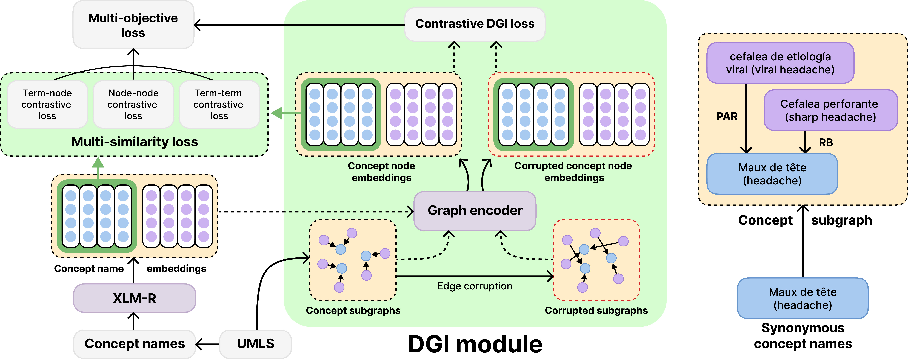

# BERGAMOT

This repository provides models, source code, and data for **BERGAMOT**: Biomedical Entity Representation with Graph-Augmented Multi-Objective Transformer which will be presented at [NAACL 2024](https://2024.naacl.org/).



# Overview

**TODO**

# Environment

Required libraries are listed in [requirements.txt](https://github.com/Andoree/BERGAMOT/blob/main/requirements.txt). We ran our experiments using Python 3.8.

**TODO**

# Data

**TODO**


# Training

**TODO**

# Evaluation

**TODO**


# Pre-trained model

GAT-BERGAMOT: [https://huggingface.co/andorei/BERGAMOT-multilingual-GAT](https://huggingface.co/andorei/BERGAMOT-multilingual-GAT):

```
from transformers import AutoTokenizer, AutoModel

tokenizer = AutoTokenizer.from_pretrained("andorei/BERGAMOT-multilingual-GAT")
model = AutoModel.from_pretrained("andorei/BERGAMOT-multilingual-GAT")
```


# Citation

**TODO**
